# Table of Contents

1.  [Table of Contents](#org1c44f2c):TOC:
2.  [2026-05-26](#org281f825)
    1.  [[08:53]](#orgf0b34d0)
    2.  [[09:20]](#orga75f7db)
    3.  [[09:36]](#org092db50)
    4.  [[09:48]](#org182b1a3)
    5.  [[09:56]](#org35f5ed3)
    6.  [[10:34]](#org2673c26)
    7.  [[11:10]](#orgf68d57a)
    8.  [[13:58]](#org628dcb8)
    9.  [[14:59]](#orge95789c)
3.  [2026-05-27](#orga36ea33)
    1.  [[10:20]](#orge1af884)

# Table of Contents     :TOC:

-   -   ]
    -   ]
    -   ]
    -   ]
    -   ]
    -   ]
    -   ]
    -   ]
    -   ]
-   -   ]

# 2026-05-26

## [08:53]

Estoy empezado a analizar las mediciones de la semana pasada con la rampa en la cuba grande del Laboratorio.

El Viernes pasado había llegado a analizar la medición del sensor posterior a la rompiente para el forzado con decaimiento lineal, cuya serie temporal fue la siguiente:

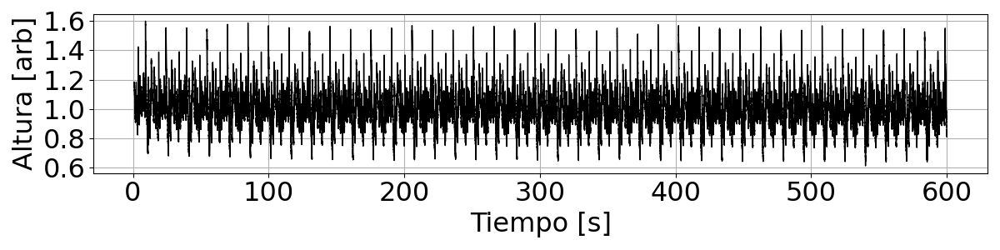

Y el zoom para uno de los segmentos de 15 segundos (que se repite) es:

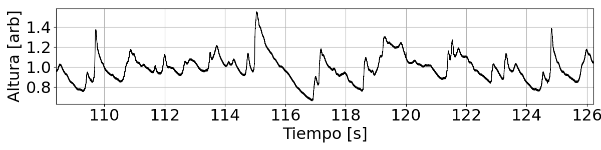

La PSD usando Welch con ventanas de 20 segundos es el siguiente:

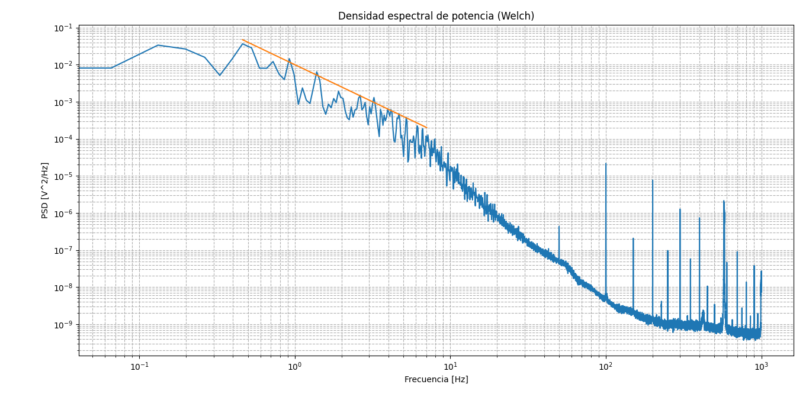

Con la lineal naranja de pendiente $f^{-2}$. Aunque a diferencia de lo predicho por (NO_ITEM_DATA:bonnetonEnergyDissipationSpectra2023) la cola resulta distinta a una caída exponencial, y se ven las pendientes de WWT.

A modo de comparación, la serie temporal que usa Bonneton, que es tomada de una gran facility, medida por van Noorloos en (NO_ITEM_DATA:vannoorloosEnergyTransferShort) se ve así:

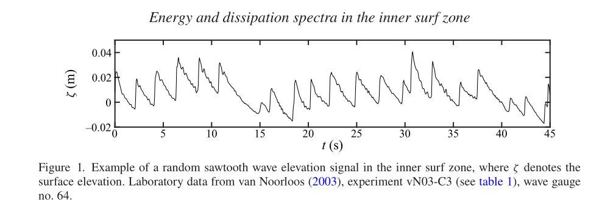

## [09:20]

La serie temporal para el sensor posterior a la rompiente bajo el forzado con decaimiento de una segunda tangente hiperbólica es la siguiente:

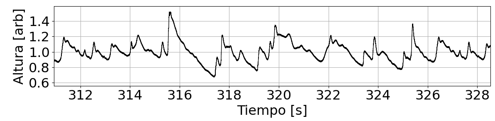

En general resulta bastante parecida a la de la caída lineal.

## [09:36]

El espectro en este caso es el siguiente:

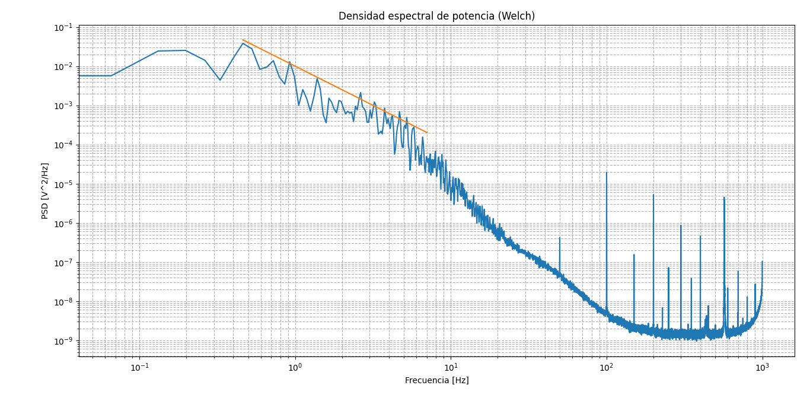

## [09:48]

Una idea para el canal podría ser directamente una pecera de 10 cm de ancho con una tercera placa de vidrio en el medio que se pueda mover para regular el ancho utilizable.

## [09:56]

A continuación los resultados para el forzado con una función senoidal de `7 cm` de carrera y `1 s` de periodo.

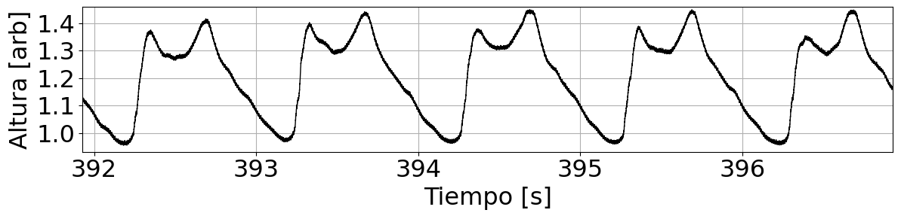

Y su espectro asociado:

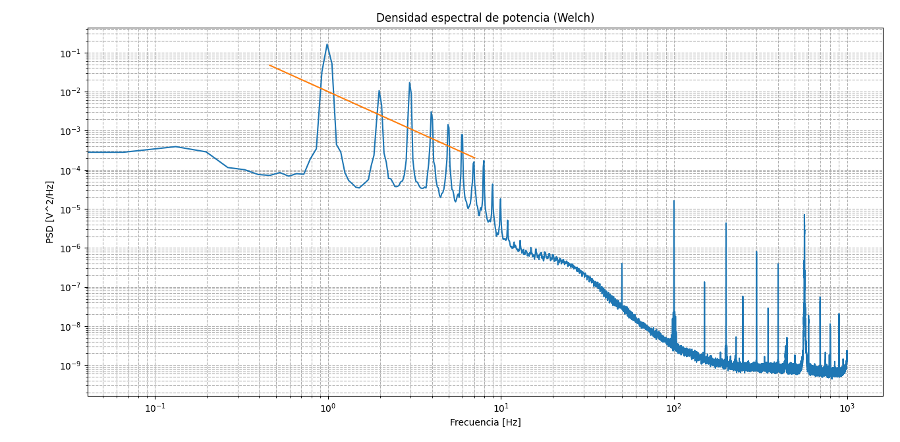

## [10:34]

La idea ahora va a ser resolver la Ecuación de Burgers para saber cuán larga tiene que ser la señal para que el espectro esté convergido y tenga la forma de $csch^2(\omega)$. Para esto usamos la Ecuación (2.3) de (NO_ITEM_DATA:bonnetonEnergyDissipationSpectra2023).

## [11:10]

Para que Fede pueda medir mañana saqué la rampa y los sensores, aunque quedaron todas las posiciones marcadas. Además, desplazamos horizontalmente el motor hacia adentro, pero en la misma posición donde ya estaba. Una cosa a sumar a los cambios de la rampa es que ésta se llenó completamente de agua, abría que poner un desagote o algo por el estilo.

## [13:58]

Ya analicé las mediciones con tres sensores donde la caída es lineal:

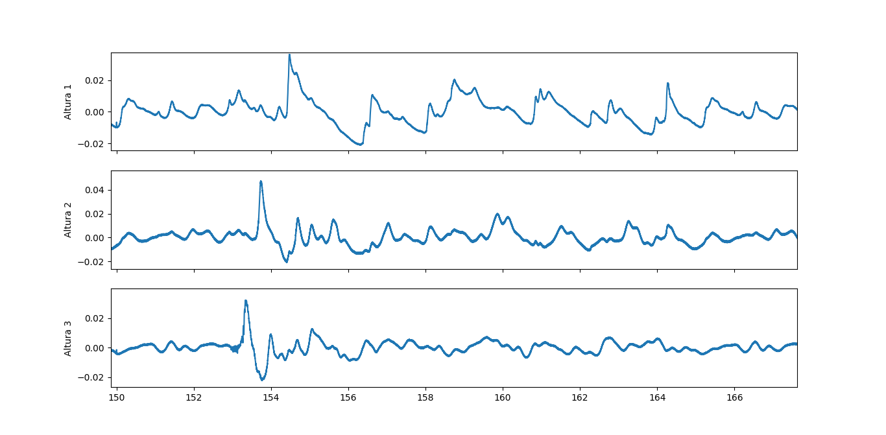

La cuestión me parece que va a seguir siendo el tema de la calibración distinta entre los sensores. Si pudiésemos mandar una onda de altura constante se podría calibrar con eso.

La altura 1 se corresponde al más lejano, la 2 al intermedio y la 3 al más cercano a la paleta. La distancia entre 1 y 2 es mayor a la que hay entre 2 y 3, lo cual es congruente con el tiempo entre el pico principal de un sensor al siguiente, si asumimos una velocidad de propagación aproximadamente constante de las ondas.

## [14:59]

Los espectros para las tres series temporales son los siguientes.

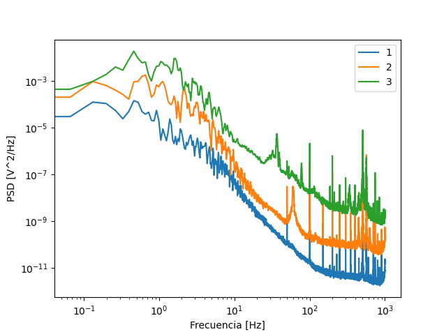

# 2026-05-27

## [10:20]

Sigo con la solución numérica a la Ecuación de Burgers. Una cosa que pensé ayer es que los estados $v(x, t_0)$ se parecen mucho a los estados que medimos para $\eta(x_0, t)$ después de la rompiente.

Al iniciar con un estado aleatorio y dejarlo evolucionar obtenemos lo siguiente:

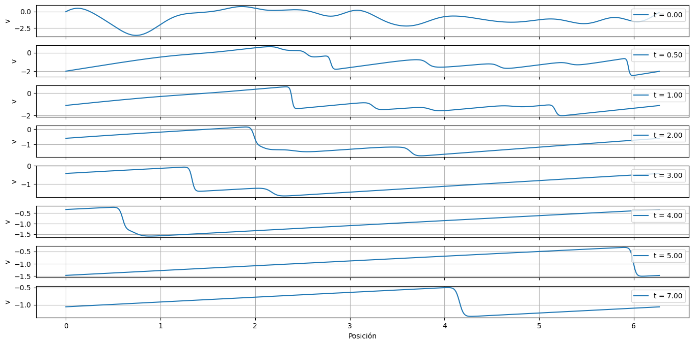

La serie temporal en el centro es la siguiente:

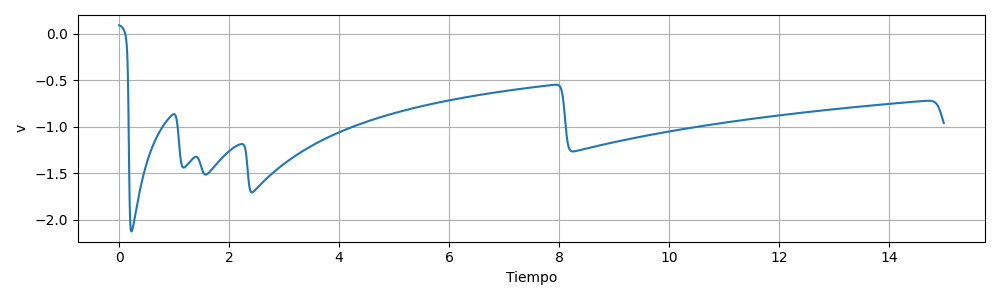

Con un espectro asociado (en distintas posiciones hasta la mitad) que sigue la Ley predicha por Bonneton:

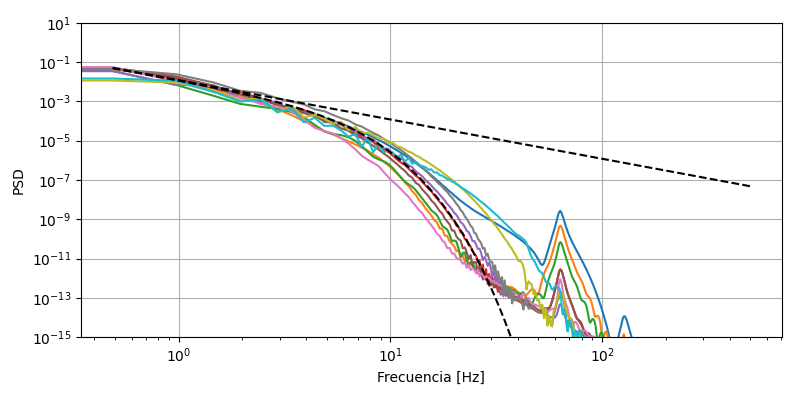

Donde la línea punteada representa el $csch^2(f)$ y la lineal es la aproximación a $f\ll1$.

